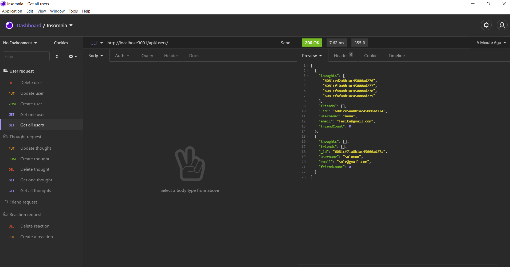

# Social Network API
[](https://opensource.org/licenses/MIT)
## Description

This assignment works on  build an API for a social network web application where users can share their thoughts, react to friends’ thoughts, and create a friend list.It mainly built with Express, Mongoose, and MongoDB.

## Installation
```npm install```  
## Usage
 - Walkthrough video link:  (https://drive.google.com/file/d/1IVvEceINx1XlgZQZk6uSWen-X9CyP1uC/view?usp=sharing)

social

 ## Licence
This Licence belongs to MIT 

## Questions
If you have any question about the repo, open an issue or contact me directly at [fasikaWalle](https://github.com/fasikaWalle/)

